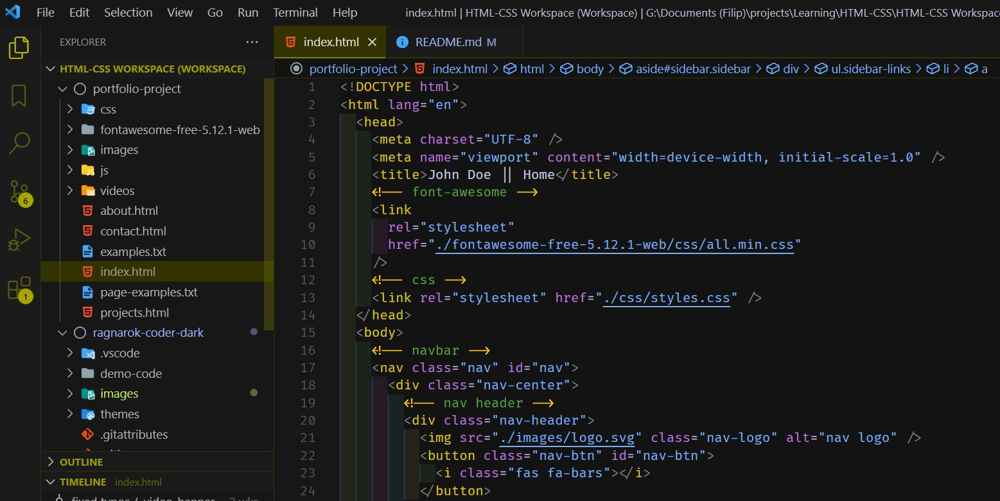
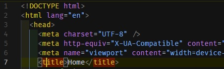

# Ragnarok Coder Dark

##### Version: 1.0.1

A yellow / blue accented Visual Studio Code theme with a dark grey background currently optimized for HTML / CSS / JS (also includes Markdown (MD) and JSON).
Developed for my personal use, and perhaps, for some others who prefer to type away under the comfort of a dark theme. It was designed to be fairly easy on the eyes, with lower contrasts and darker colors.

I intend to tweak the colors further while researching color theory more.

Other programming language support - soon to come!

## PREVIEW

## HOW TO INSTALL

1. Install Visual Studio Code and open the program
2. Click on **Extensions** (CTRL + SHIFT + X | _default hotkey_)
3. Search for **Ragnarok Coder Dark**
4. Click on **Install**
5. a) Click on **Ragnarok** from the dropdown
6. b) Alternatively go: _file > Preferences > Color Theme_ > **Ragnarok**

## OTHER INFO

This was my first attempt into theme creation with VS Code. Any feedback, ideas, bug reports, etc. are more than welcome. Feel free to contact me by [reporting an issue](https://github.com/CaptRagnarok/portfolio-project-grid-practice/issues).

##### KNOWN ISSUES

Upon styling the theme, I couldn't find a way to address how to highlight opening and closing HTML tags properly.

Usually one would need an extension in order to light up the closing tag while clicking on the opening one, and vice versa, but VS Code seems to have added built in support for that.

As of that moment, I seemingly cannot locate which part of code corresponds to that mechanic and am unable to change it so it remains a brownish color. As soon as the fix is available, or I get info how to do it, I intend to align the color with the theme.

##### FURTHER PLANS

1. Further tweak colors, while researching color theory, to increase legibility while not increasing eye strain.
2. Check if the theme is colorbling accessible and tweak it if it is not.
3. Cover the other languages. Support (syntax highlighting) for them doesn't currently exist, but will put some default colors soon, so that it at least is usable until I get around to that.

##### CONTRIBUTIONS AND THANKS

A big thank you to **Sarah Drasner**, the author of the famous _Nightowl_ theme, who pointed me in the right direction with her article: [https://css-tricks.com/creating-a-vs-code-theme/](https://css-tricks.com/creating-a-vs-code-theme/).

And another thanks to **Jessica a.k.a. Coder Coder** who helped me grasp how to "swim" across the Microsoft marketplace and publish my theme. Check out her [video](https://www.youtube.com/watch?v=pGzssFNtWXw) on the subject!
